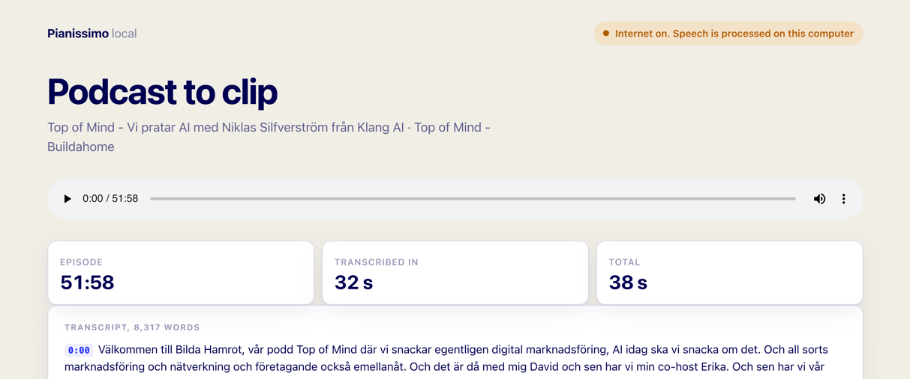
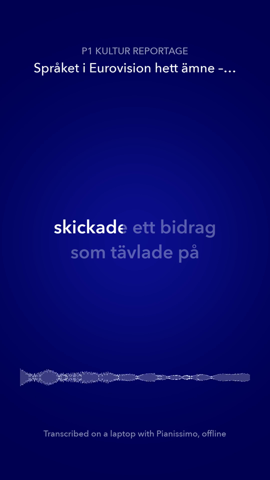

# Any podcast to a clip, on your own machine

Paste a podcast, get the transcript, and turn any sentence into a vertical clip with captions
that light up word by word. Pianissimo does all of it, on this machine, behind a local web
server. Download the model, and any episodes you want, before going offline.





*Left: a 52 minute episode, transcribed in 32 s on a MacBook Pro M5, 38 s including the
download. Right: a clip made from one sentence of a P1 Kultur report. The captions light up
word by word as it is spoken.*

The same server has a second page, dictation: Swedish speech to text as you speak, and the
only page that never needs the internet. The podcast page needs it once, to fetch the episode.

Reviewing the code rather than running it? Start with [REVIEW.md](REVIEW.md).

What uses the network:

- the link or search words you paste, sent to Apple's podcast directory or the site that
  hosts the episode, and the audio download itself;
- cover images, loaded from the podcast's own servers when a page shows them;
- the badge in the corner, which every 3 s opens a TCP connection to 1.1.1.1:443, or
  8.8.8.8:53 if that fails, and sends nothing over it.

What does not: anything you record, upload or transcribe. Transcription, clips and dictation
run locally, and the browser only talks to the server on `127.0.0.1`. The badge in the corner
says whether the machine has internet right now; turn the Wi-Fi off and it flips to "No
internet. Still works", which is the point.

## Setup

Python 3.10 or later, and ffmpeg.

Run everything from the repo root.

```bash
python3 -m venv .venv && .venv/bin/pip install "nemo_toolkit[asr]" aiohttp soundfile
brew install ffmpeg
brew install ffmpeg-full   # only for clips: it has libass, which burns captions in
```

Download the model once, with the network on:

```bash
.venv/bin/hf download KlangAI/pianissimo-sv
```

That is 2.34 GB.

## Run

```bash
.venv/bin/python examples/offline/server.py
```

Open http://127.0.0.1:8765. The first start takes a few seconds while the model loads;
after that the server is ready.

Tests for the parts that need no model:

```bash
python3 examples/offline/test_offline.py
```

## A link, or just a name

The box on the podcast page takes:

| You paste | What happens |
|---|---|
| An Apple Podcasts link | Looked up in Apple's public directory. |
| Sveriges Radio | Its open API, since its pages refuse plain requests. |
| An RSS feed, or a page with a player on it | The feed's episodes, or the audio the page plays. |
| A direct link to an audio file | Downloaded as is. |
| Just words, like `sommar i p1 zlatan` | A search for episodes in Apple's directory, Swedish storefront. |

Spotify and YouTube are not supported. Spotify does not hand out episode audio, and
downloading from YouTube is against its terms. Almost every podcast also publishes a public
RSS feed; paste that, or the show's Apple Podcasts link.

The page says when the download is done. From there the episode can be transcribed and
clipped with the Wi-Fi off.

## How it works

**Transcript.** The audio is decoded to 16 kHz mono with ffmpeg and cut into 30 s pieces.
Pianissimo transcribes them eight at a time, and each piece lands on the page as it is done,
with the timestamp of where it starts. Click a timestamp to play from there.

**Clip.** The selected text is found in the transcript, that stretch of audio is transcribed
again with a timing for every word, and ffmpeg draws the frame: the show at the top, a
waveform, and captions where each word fills in as it is said (ASS karaoke tags). A second
pass can hear a word slightly differently from the first, and the captions follow the second
pass, because that is the one the timings belong to.

**Dictation.** The microphone streams 16 kHz PCM over a WebSocket. The open segment is
transcribed again every 0.4 s, so the text updates as you speak, and a segment closes after
0.6 s of quiet or at 12 s.

## What we measured

Each measured once, on a MacBook Pro with an M5 and 24 GB. A 52 minute episode: 32 s from
the download finishing to the last piece on the page, just under 100 times real time. That
includes decoding with ffmpeg.

A 3 s clip in about 4 s, from the request to the video on the page.

Dictation shows new text every 0.4 s, and each update takes 130 to 350 ms.

## Limits

- No speaker separation. The transcript says what was said, not who said it.
- Dictation re-reads the open sentence as you speak, so the last few words can change until
  you pause. Stop waits up to 30 s for the last words; if the model is busy longer than that,
  the text already on screen is kept.
- A clip's captions can differ slightly from the transcript, because the stretch is
  transcribed a second time to get word timings.
- Nothing is cleaned up while the server runs. Episodes and clips stay on disk until it stops.

---

Part of [pianissimo-examples](../../). Pianissimo is made by [Klang](https://klang.ai/pianissimo/?utm_source=github&utm_medium=referral&utm_campaign=pianissimo-subtitles&utm_content=readme-offline).
